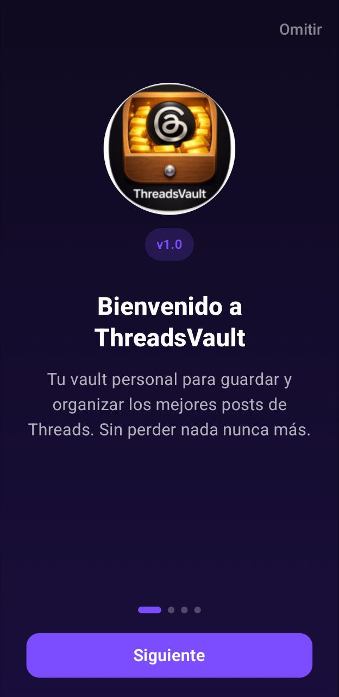
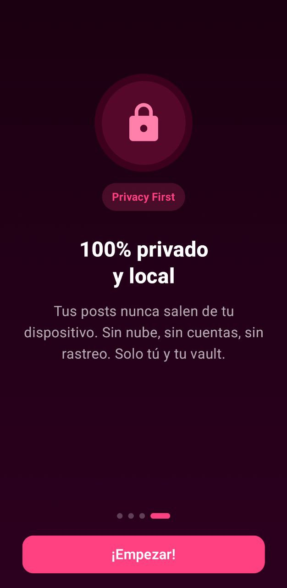
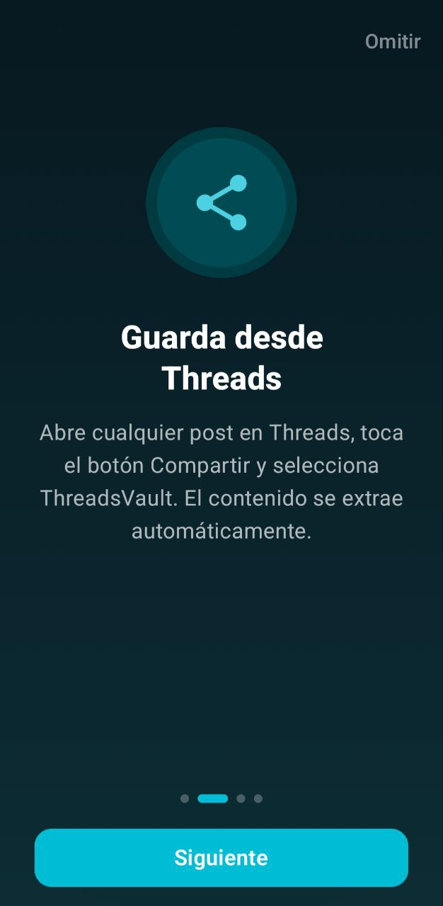
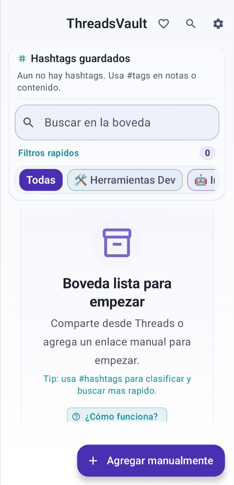
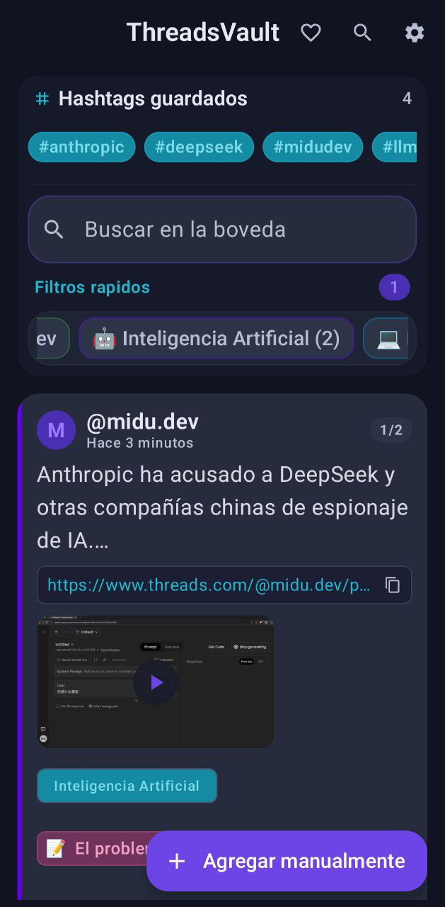
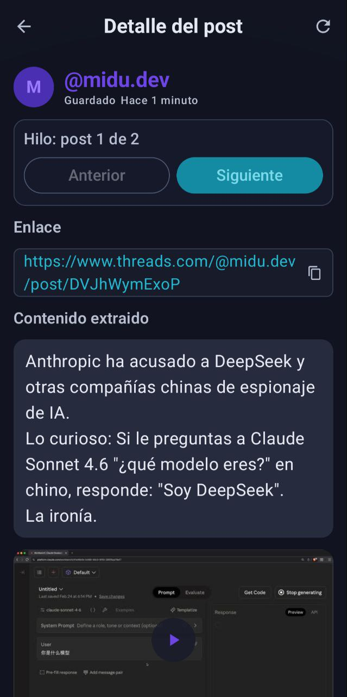
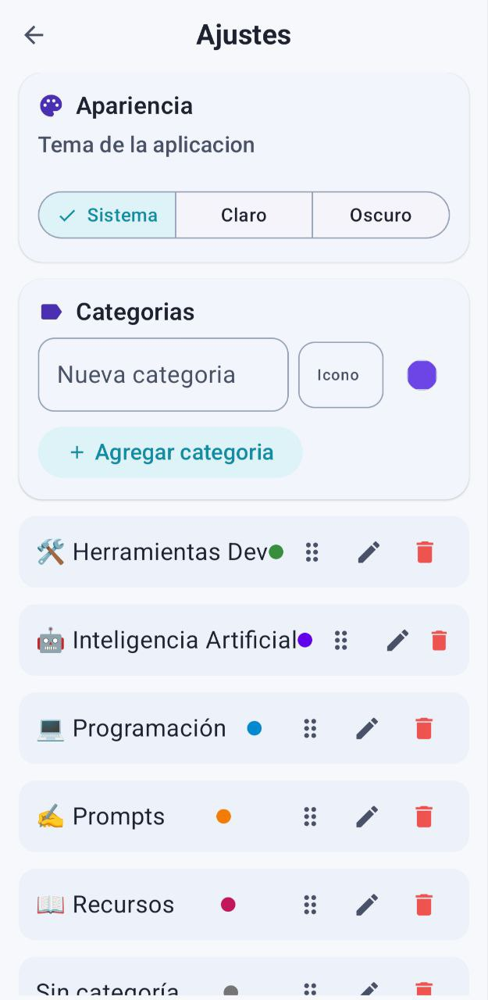
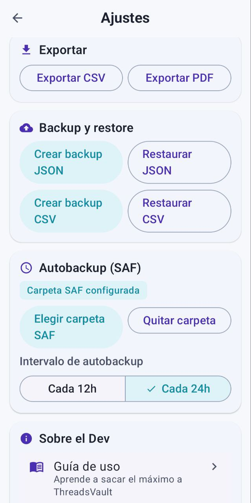

# ThreadsVault


[](https://developer.android.com/)
[](https://kotlinlang.org/)
[](https://developer.android.com/jetpack/compose)
[](#)
[](https://www.gnu.org/licenses/gpl-3.0)
[](https://www.anthropic.com/claude-code)
[](https://openai.com/)

<p align="left">
  <a href="./README.md">Read in English</a>
</p>

> 🖥️ También disponible para escritorio: **[ThreadsVault Desktop](https://github.com/D4vRAM369/threadsvault-desktop)** — app nativa para Windows y Linux, compatible con los backups de esta app.

## 📱 Capturas de pantalla

<div align="center">

<table>
  <tr>
    <td align="center">
      
      <br/><sub><b>Welcome</b></sub>
    </td>
    <td align="center">
      
      <br/><sub><b>100% Private & Local</b></sub>
    </td>
    <td align="center">
      
      <br/><sub><b>Save from Threads</b></sub>
    </td>
    <td align="center">
      
      <br/><sub><b>Vault ready</b></sub>
    </td>
  </tr>
  <tr>
    <td align="center">
      
      <br/><sub><b>Posts feed</b></sub>
    </td>
    <td align="center">
      
      <br/><sub><b>Post detail</b></sub>
    </td>
    <td align="center">
      
      <br/><sub><b>Custom categories</b></sub>
    </td>
    <td align="center">
      
      <br/><sub><b>Backup & SAF Autobackup</b></sub>
    </td>
  </tr>
</table>

</div>

## Por qué existe

Threads en mi experiencia es bastante bueno para descubrir contenido, noticias, herramientas de IA o de programación (en cuanto a mi preferencia personal) y demás intereses.
Pero los buenos posts se pierden rápido en la infinidad tras un autoscroll, y no me gusta la idea de únicamente tener acceso a ese contenido en Guardados dentro de la app, o tener que copiar uno a uno para llevarlos a otro sitio.

Por ello he decidido crear una app para Android con una bóveda donde poder enviar las publicaciones y con extracción de imágenes mediante OCR (vídeos no he conseguido hacerlos funcionar), con posibilidad de añadir notas, favoritos y dividirlo en distintas categorías que se pueden crear.

## Funciones

- Guardar enlaces de Threads desde el Share Sheet de Android.
- Agregado manual de enlaces dentro de la app.
- Extracción de preview del enlace y parsing de contenido.
- Hipervínculos clicables dentro del contenido del post guardado.
- #hashtags clicables con chips de filtro instantáneo.
- OCR de texto desde imágenes del post.
- Notas rápidas por elemento guardado.
- Categorías con emoji y color, con chips de contraste dinámico.
- Favoritos y buscador.
- Exportar a CSV y PDF.
- Backup y restore (JSON/CSV). Los backups de esta app se pueden importar en [ThreadsVault Desktop](https://github.com/D4vRAM369/threadsvault-desktop) *(Android → Desktop ✅)*. La dirección inversa aún no está soportada.
- Autobackup con selección de carpeta SAF.
- Tema claro, oscuro o sistema.
- Tutorial "Cómo usar" integrado en la app.
  
## Compatibilidad experimental con Instagram (observada)

ThreadsVault extrae parcialmente el contenido de algunos enlaces de publicaciones públicas de Instagram (observado durante las pruebas). Todavía no se trata de una compatibilidad oficial completa con Instagram.

  Comportamiento conocido:
  - El autor del encabezado puede aparecer como «@unknown»
  - El recuento de «Me gusta», la fecha de publicación, el nombre de usuario, el enlace de la publicación y a veces, una vista previa de la imagen pueden aparecer en el contenido extraído (normalmente como texto de metadatos)
  - Los resultados pueden variar en función de la publicación o el enlace.

## Privacidad

- Diseño local-first.
- Sin anuncios.
- Sin SDK de analítica.
- Sin Firebase.
- Sin servicio de crash tracking.

## Limitaciones (v1.0.0)

- Los vídeos de Threads usan enlaces que expiran y requieren sesión activa; la app detecta si un post tiene vídeo y guarda el enlace para abrirlo en Threads, pero no puede reproducirlo ni almacenarlo localmente.
- La calidad del OCR depende de la resolución y claridad del texto en la imagen fuente.
- Solo extrae una imagen para la publicación (si deseas extraer más de una, comparte la imagen como una publicación y mézclala con la original).
- La importación de backups desde ThreadsVault Desktop aún no está soportada *(Desktop → Android)*; se resolverá en una versión futura.

## Stack técnico

- Kotlin
- Jetpack Compose
- Room
- DataStore
- WorkManager
- Coil
- Jsoup
- ML Kit Text Recognition (OCR on-device)

## Build

Requisitos:

- Android 8.0+ (API 26)
- Android Studio (stable reciente)
- JDK 17
- Android SDK 35

Comandos:

```bash
./gradlew :app:assembleDebug
./gradlew :app:assembleRelease
```

## Nota de tamaño actual

- El APK debug pesa bastante más por diseño.
- El release actual con minify + shrinkResources ronda 43 MiB como APK universal.
- Con AAB/splits, el tamaño final por dispositivo baja bastante.

## Ideas de roadmap

- ✅ Versión de escritorio disponible para Windows y Linux: [ThreadsVault Desktop](https://github.com/D4vRAM369/threadsvault-desktop)
- Flavor FOSS de OCR para distribuciones sin Google (IzzyDroid lo requiere y me gustaría subirlo ahí), además de que va con mi ideología como desarrollador y será bueno para subir la aplicación a otros sitios de código abierto.
- Mejorar import/export.
- Mejorar filtros y organización más inteligente.
- Intentar mejorar e implementar la compatibilidad experimental actual con Instagram _(solo un quizás)_.
- Añadir un reproductor de vídeo integrado en la app (si es posible) y permitir la descarga de vídeos.
- Nuevas funciones que irán surgiendo sobre la marcha en cualquier momento, y en mis sesiones de estudio PBL de horas interminables con diferentes IAs y herramientas.

## Sobre el Dev

Este proyecto ha sido creado por **D4vRAM** mediante **PBL (Aprendizaje Basado en Proyectos)**, usando a la IA como mentora en un proceso de aprendizaje constante, como lo es con cada proyecto que realizo. Transformando ideas y soluciones a problemas en código.

Para y por la comunidad open source, con amor ❤️

<sub><em>"No usar la IA para programar hoy en día es como ser agricultor y no querer usar el tractor."</em></sub>

~

**Not vibe-coding, just vibe and code!**
